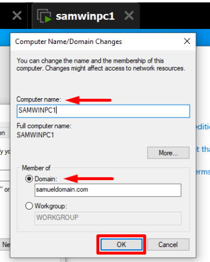
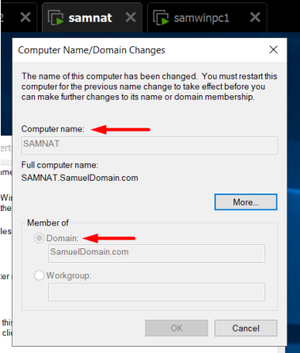

# NAT and Routing with RRAS

This chapter documents RRAS routing and NAT for the lab, including SAMNAT interface preparation, domain membership, NAT configuration, and outbound connectivity tests.

## Technical Context

SAMNAT uses an internal LAN interface and an external bridged interface. RRAS provides NAT so internal systems can reach external networks without direct external addressing.

PAT is documented as a NAT translation method. It lets multiple internal systems share one external address through unique port mappings.

This makes the isolated lab usable for DNS forwarding, updates, and connectivity tests while keeping the internal subnet controlled.

**Implemented controls:**

- Renamed SAMWINPC1 and SAMNAT and joined both systems to `samueldomain.com`.
- Configured separate LAN and WAN interfaces on SAMNAT.
- Installed the Remote Access role for RRAS.
- Enabled NAT and LAN routing.
- Marked the WAN adapter as the public NAT interface.
- Validated outbound connectivity from internal systems.

## Key Technical Terms

| Term | Meaning in this chapter |
|------|-------------------------|
| RRAS | Routing and Remote Access Service, the Windows role used here for lab routing and NAT. |
| NAT | Network Address Translation, which lets private internal hosts communicate through a translated external path. |
| PAT | Port Address Translation, where multiple internal sessions share one outside address by using unique ports. |
| LAN interface | The internal adapter facing the domain subnet. |
| WAN interface | The adapter facing the external or bridged network path. |

---

## Detailed Walkthrough

### Step 01 - Name and join SAMWINPC1 and SAMNAT to the domain

The Windows 10 client is renamed `SAMWINPC1` and joined to `samueldomain.com`, making it easy to identify in AD, DNS, DHCP leases, GPO results, and logs.

<strong>Screenshot 028 - SAMWINPC1 Domain Membership:</strong> SAMWINPC1 configured with its computer name and joined to the samueldomain.com domain.

The routing server is renamed `SAMNAT` and joined to the domain. Windows reports the full computer name as `SAMNAT.SamuelDomain.com`.

> RRAS and NAT can run on a standalone server. In this lab, domain membership adds centralized administration, domain authentication, DNS registration, and consistent management access.

<strong>Screenshot 029 - SAMNAT Domain Membership:</strong> SAMNAT joined to SamuelDomain.com with the full computer name SAMNAT.SamuelDomain.com.

---

### Step 02 - Configure SAMNAT network interfaces

SAMNAT has a LAN interface for the internal `192.168.116.0/24` network and a WAN interface connected to the bridged external network.

> A NAT router needs an inside and outside network. The LAN adapter faces the domain, while the WAN adapter provides the external path.

<strong>Screenshot 030 - SAMNAT NIC Setup:</strong> SAMNAT domain membership and network interface setup.

---

### Step 03 - Install the Remote Access role

The Remote Access role is installed to provide Routing and Remote Access Service functionality.

> RRAS provides routing, NAT, and remote-access capabilities. Here it is used for router/NAT service, not direct external exposure of internal machines.

<strong>Screenshot 034 - Remote Access Role Selection:</strong> Remote Access role selected for NAT/RRAS.

---

### Step 04 - Enable NAT and LAN routing

RRAS is configured with NAT and LAN routing. This allows internal hosts to send traffic through SAMNAT.

> NAT translates private internal addresses for external communication. PAT tracks sessions by port so multiple hosts can share the same outside path.

<strong>Screenshot 036 - NAT and LAN Routing Selection:</strong> RRAS custom configuration with NAT and LAN routing.

---

### Step 05 - Mark the WAN interface as public

The WAN interface is selected as the public interface connected to the external network. NAT is enabled on this interface.

> RRAS must know which adapter is internal and which is external; selecting the wrong public interface can break routing or expose the wrong side.

<strong>Screenshot 037 - NAT Public Interface Configuration:</strong> NAT public interface configuration.

---

### Step 06 - Validate internet connectivity from DC1

After NAT is configured, DC1 can reach an external DNS address. This proves that internal systems can route outbound traffic through SAMNAT.

> Connectivity testing proves the full path: DC1 sends traffic to SAMNAT, NAT translates it, and the response returns correctly.

<strong>Screenshot 038 - DC1 Internet Connectivity Test:</strong> DC1 ping test to public DNS through NAT.

---

## Validation and Summary

Validation confirms RRAS role selection, NAT/LAN routing, public interface selection, and ping tests from DC1, DC2, and the Windows 10 client.

This chapter provides outbound lab connectivity through SAMNAT. That path supports later external DNS forwarding tests, client connectivity checks, and lab-only remote-access validation.

---

## Project Chapters

| # | Chapter |
|---|---------|
| 0 | [Project Overview](../../README.md) |
| 1 | [Topology and Lab Environment](../01-topology-and-lab-environment/README.md) |
| 2 | [Active Directory Domain Services](../02-active-directory-domain-services/README.md) |
| 3 | [NAT and Routing with RRAS](../03-nat-and-rras-routing/README.md) |
| 4 | [DHCP Services and Failover](../04-dhcp-services-and-failover/README.md) |
| 5 | [Remote Administration](../05-remote-administration/README.md) |
| 6 | [DNS Services and Name Resolution](../06-dns-services-and-name-resolution/README.md) |
| 7 | [Roaming and Mandatory Profiles](../07-roaming-and-mandatory-profiles/README.md) |
| 8 | [File Services and Access Control](../08-file-services-and-access-control/README.md) |
| 9 | [Group Policy Hardening and Software Deployment](../09-group-policy-hardening-and-software-deployment/README.md) |
| 10 | [Password Policy and Account Security](../10-password-policy-and-account-security/README.md) |
| 11 | [Final Summary](../11-final-summary/README.md) |
